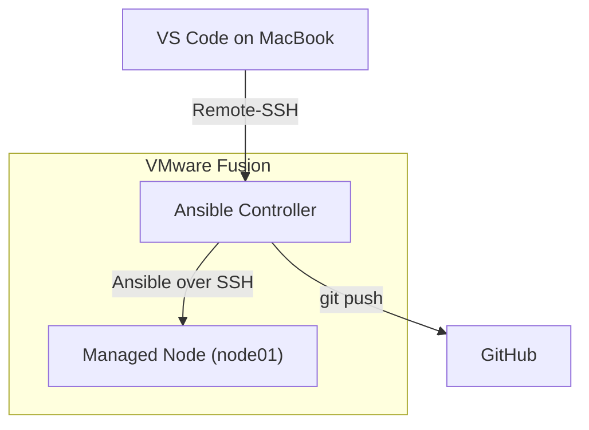

# Ansible Lab Setup

## Architecture



---

## Make Each Clone Unique

The Ansible Controller and the Managed Node are clones of the same base RHEL 10 VM (ARM/aarch64). Because a clone is an exact copy, both VMs start out with identical system identities. A few settings must be reset on **each** VM to make it unique.

```bash
# Set a unique hostname (use node01 on the Managed Node)
sudo hostnamectl set-hostname controller

# Set a unique machine ID (duplicates can cause IP address conflicts)
sudo rm -f /etc/machine-id
sudo systemd-machine-id-setup

# Remove the SSH host keys (regenerated automatically when sshd starts)
sudo rm -f /etc/ssh/ssh_host_*

# Re-register the clone with the Red Hat developer subscription
sudo subscription-manager clean
sudo subscription-manager register

# Reboot to apply all changes
sudo reboot
```

---

## Name Resolution for node01 (on the Controller)

Lets the Controller reach node01 by name instead of IP address:

```bash
# Add node01 to /etc/hosts (replace <node01-ip> with the real IP)
echo "<node01-ip> node01" | sudo tee -a /etc/hosts

# Test name resolution and connectivity
ping -c 3 node01
```

---

## SSH Keys: Controller &rarr; node01

Ansible connects to its nodes over SSH, so the Controller must log in **without a password**.

```bash
# Create a key pair (~/.ssh/id_ed25519 and id_ed25519.pub)
ssh-keygen -t ed25519

# Copy the public key to node01
ssh-copy-id node01

# Test: should log in without a password
ssh node01
hostname
exit
```

---

## Install Ansible on the Controller

```bash
sudo dnf install -y ansible-core
ansible --version
```

---

## VS Code on the MacBook &rarr; Controller

I use VS Code's Remote-SSH extension on my MacBook to work directly on the Controller. Playbooks run on the Controller, and I edit and commit the Git repository there.

`~/.ssh/config` on the **MacBook**:

```
Host ansible-controller
    HostName 192.168.2.136
    User student
    IdentityFile ~/.ssh/cloud_id_ed25519
    IdentitiesOnly yes
```

`IdentityFile` points to the **private** key. `IdentitiesOnly yes` makes SSH try only that key, nothing else.

---

## GitHub from the Controller

```bash
# Set the Git identity
git config --global user.name "laba4"
git config --global user.email "ansible@iac.org"

# Show the public key, then add it on GitHub: Settings → SSH and GPG keys
cat ~/.ssh/id_ed25519.pub

# Test the connection to GitHub
ssh -T git@github.com

# Clone the repository with the SSH URL
git clone git@github.com:laba4/penguin-docs.git
```

I reused my existing key `~/.ssh/id_ed25519`. **No SSH config is needed**, because SSH automatically tries default key names (`id_ed25519`, `id_rsa`, …).

### Optional: A Separate GitHub Key

A dedicated key can be created just for GitHub:

```bash
ssh-keygen -t ed25519 -f ~/.ssh/id_ed25519_github -C "controller-github"
```

`~/.ssh/config` on the **Controller**:

```
Host github.com
    IdentityFile ~/.ssh/id_ed25519_github
```

This config entry is only needed because the key has a **non-default name**.

---

## Ansible Project and First Test

Project folder: `~/penguin-docs/ansible/`

`inventory.ini` lists the machines Ansible manages:

```ini
[nodes]
node01
```

`ansible.cfg` sets the default inventory, so I don't have to type `-i inventory.ini` every time:

```ini
[defaults]
inventory = inventory.ini
```

Ansible reads `ansible.cfg` from the **current directory**, so I run commands from inside `ansible/`.

### Test

```bash
ansible all -m ping
```

---

## Lessons Learned

- Managed Nodes need only **SSH + Python**, no Ansible agent
- Ansible `ping` is an SSH + Python check, not an ICMP ping
- `IdentityFile` should point to the **private** key
- SSH tries default key names automatically; custom names need a config entry
- `IdentitiesOnly yes` avoids "Too many authentication failures"
- SSH keys beat PATs for Git on servers: no expiry, no stored tokens